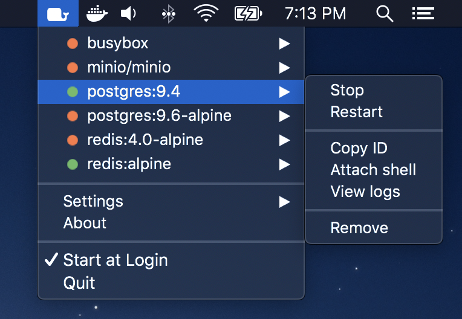

# Whale

A tiny macOS menu bar app for easily managing Docker containers.

## Features

- Start, stop, restart, and remove containers.
- Copy container ID.
- Open exposed addresses directly in the default browser.
- Attach shell or tail logs for running containers.
- Support for Terminal.app and [iTerm](https://iterm2.com/).
- Group containers by prefix.
- Dark mode support.

## Download

**[Download](https://github.com/ruggi/whale/releases/latest/download/Whale.app.zip)** from the [GitHub releases page](https://github.com/ruggi/whale/releases).

## FAQ

> MacOS will not let me install the app because it comes from a unverified developer.

Open System Preferences -> Security & Privacy -> General -> [Click `Open Anyway`](static/faq_unverified.png).

> I have a cool idea for a feature that's missing...

Ideas are more than welcome! Please go ahead and [create an issue for it](https://github.com/ruggi/whale/issues).
